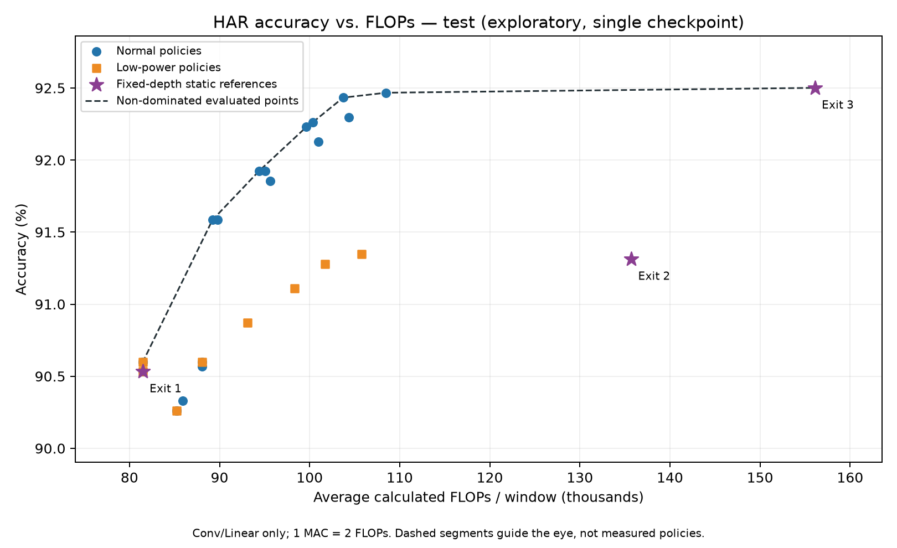

# Accuracy versus compute

Evaluate the selected model's accuracy/compute trade-off using frozen adaptive
policies and three fixed-depth references. This is evaluation, not training or
compression.

## Included results

The validation sweep contains 113 configurations: 100 normal threshold pairs,
ten low-power thresholds and three static depths. It selects 27 adaptive policies
plus the three static references. All 30 are evaluated on test, including policies
that become dominated.



Normal mode with thresholds 0.98 / 0.80 achieves 92.467% test accuracy at
108,462 FLOPs/window. The fixed full-depth reference achieves 92.501% at
156,084: **30.51% less calculated compute**, with one fewer correctly classified
test window. This is not evidence of statistical equivalence or battery savings.

See the [test report](results/pareto/test/report.md),
[operating points](results/pareto/test/operating_points.csv),
[validation plot](results/pareto/validation/pareto.png) and
[frozen policies](results/pareto/validation/policies.json).

## Run

Prepare the dataset as described in the [README](../README.md), then run from
the repository root:

```bash
python pareto_evaluate.py --split validation --device cpu --output-dir runs/pareto_v1/validation
python pareto_evaluate.py --split test --device cpu --policies runs/pareto_v1/validation/policies.json --output-dir runs/pareto_v1/test
```

Both use `models/adaptive_har.pt` by default. For a retrained model, supply the
same new `--checkpoint` to both commands. The separate `--baseline-checkpoint`
defaults to the included model and should remain fixed across comparisons.
Checkpoints must use identical dataset splits, channels, labels and sizes;
each restores its own training normalization. Use a fresh output directory.

## Selection and safeguards

- Validation uses a 10-by-10 normal threshold grid and ten low-power thresholds.
  Override with `--thresholds-1` / `--thresholds-2` on validation only.
- Keep each mode's non-dominated policies: no other policy in that mode has
  equal or lower cost and equal or higher accuracy with a strict improvement.
  Equal-coordinate ties select the first policy in sorted grid order.
- Always include all three static depths. Keeping low-power policies separately
  preserves their hard Stage-3 exclusion even when normal mode dominates globally.
- Check selected cached validation estimates against actual conditional execution.
- Test requires the validation manifest, rejects threshold grids, and evaluates
  every frozen policy. Highlighting the test frontier does not select a new policy.
- Manifests bind checkpoint, baseline and evaluation-code hashes. Changed code
  or checkpoints require new validation selection. Hashes provide traceability,
  not protection against deliberate editing.
- Refuse nonempty output directories; do not train or mutate checkpoints.

A confidence threshold of 1 is not a forced depth: floating-point softmax can
equal 1. Static references execute their depth directly and skip unused heads.

## Compute convention

FLOPs = 2 × executed Conv1d/Linear MACs. The counter uses actual tensor shapes,
including the remaining adaptive batch after each exit. Validation-grid estimates
use per-path MACs weighted by exact exit counts.

Adaptive paths pay for every visited classifier. Static paths skip intermediate
classifiers and cost 81,456 / 135,700 / 156,084 FLOPs/window.

Counts exclude bias, BatchNorm, activations, residual additions, pooling, softmax,
routing and data movement. They are a consistent Conv/Linear proxy, not complete
runtime work, measured latency, energy or battery life.

## Outputs

| File | Contents |
| --- | --- |
| `pareto.png`, `pareto.svg` | Accuracy versus compute; dashed segments are visual guides, not measured intermediate policies. |
| `operating_points.csv` | Every evaluated point, accuracy/F1, exit usage, MACs/FLOPs and dominance. |
| `results.json` | Metrics, classification reports, split/normalization metadata and runtime/code/checkpoint provenance. |
| `policies.json` | Frozen validation selection, copied unchanged into test output. |
| `baseline_comparison.json` | Accuracy differences and compute savings versus fixed full depth. |
| `report.md` | Readable results and interpretation. |

## Limits

The static references share trained weights with the adaptive model; they are
fixed-depth ablations, not independently trained static CNNs. The checkpoint is
single-seed and exploratory, with prior inspection of test subjects. This protocol
prevents additional test-threshold tuning but cannot create a fresh holdout.
Tiny differences require stronger uncertainty evidence.

Compression, independent static training and repeated training seeds are optional
extensions, not implemented features. Changes to training, preprocessing or
calibration require a new validation manifest. Quantization alone does not reduce
FLOP counts; report precision, memory and measured latency separately.

Synthetic smoke outputs only verify software. Run
`python -m unittest tests.test_pareto -v` to check selection, execution/accounting,
manifest validation, test-sweep rejection, overwrite protection and the CLI.
